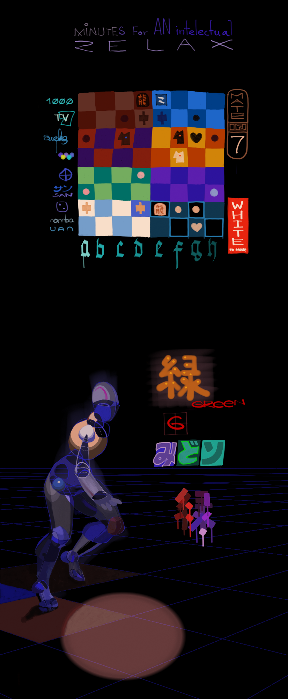
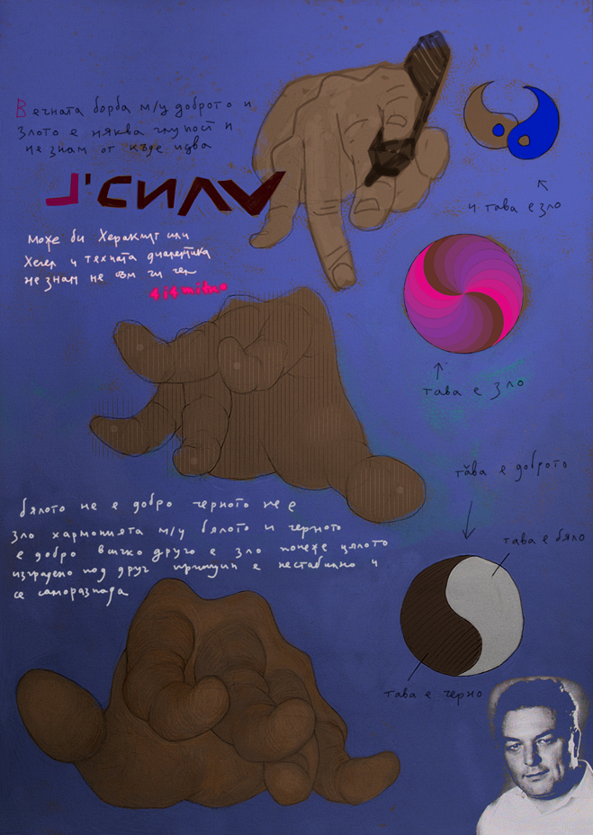
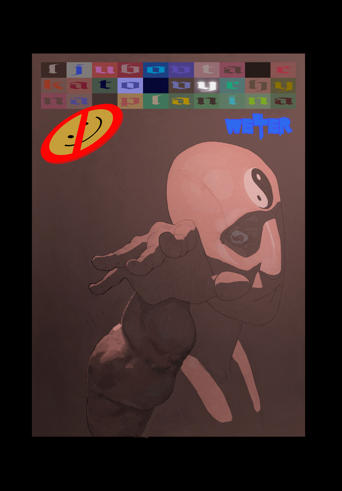

# A Game
Here the board is an array of positive integers, and there are
two players, *White* and **Black**. *White* starts first and picks a
number from either end, than **Black** and so on. The winner is the 
one with bigger sum,
[clck](https://ioinformatics.org/files/ioi1996problem1.pdf)

The statement is that *White* has winning strategy, and we have
to figure it out. For a *n-sized* board there will be *2n-1*
scenarios, for example if **n** is *4*, than the sequences of 
players' moves will be *LLL, LLR, LRL, LRR, RLL, RLR, RRL, RRR*.
The problem here is that if we scan all variations it will
take exponential time with *n*, and that's no good because at some
point it will start running forever. So we have to figure some 
***Greedy*** approach.

[Policy Of Truth](https://youtu.be/M2VBmHOYpV8)
